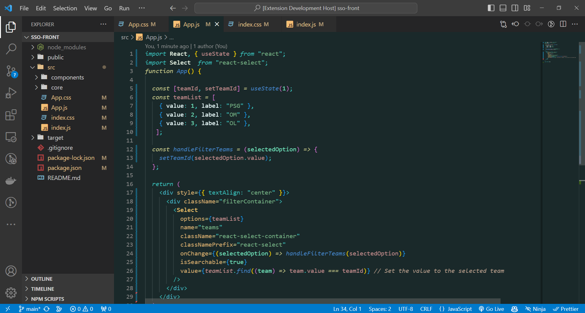
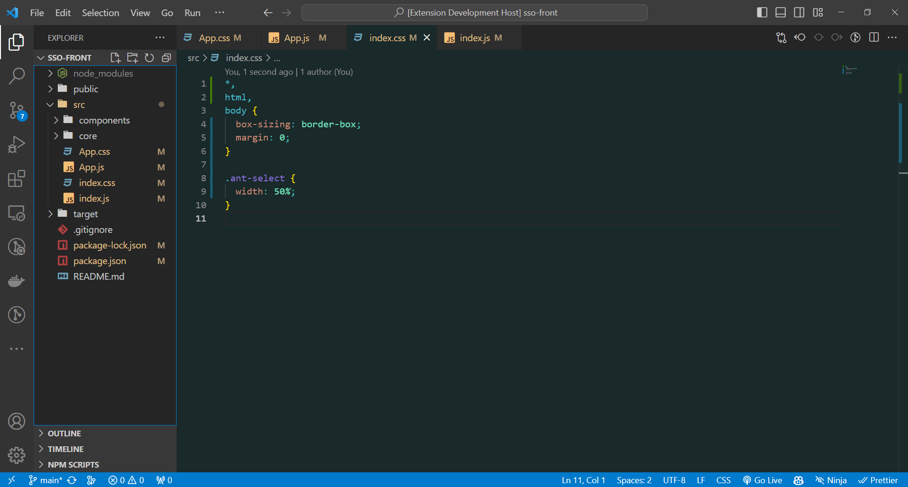
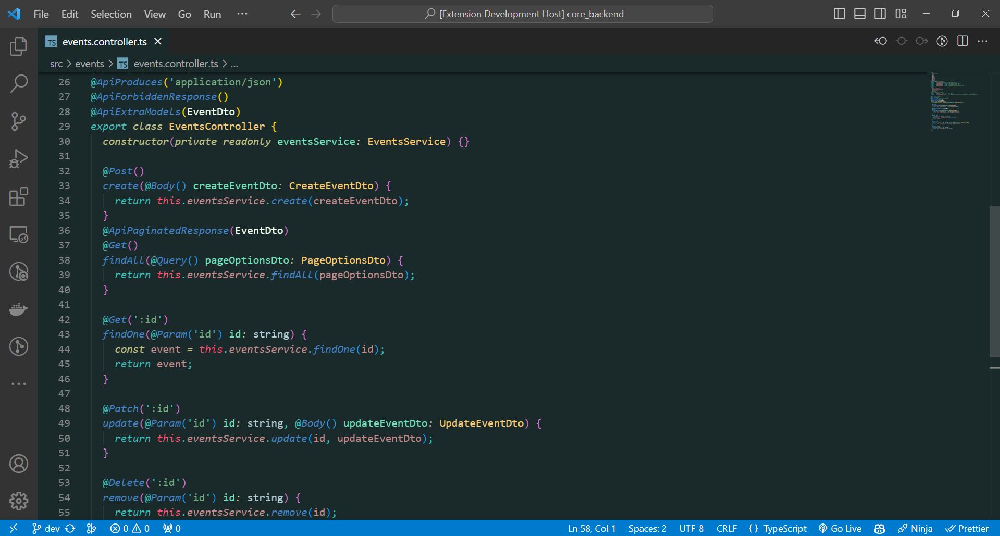

# Nightingale Theme for Visual Studio Code

## Description

Nightingale is a dark theme for Visual Studio Code that provides a soothing and comfortable coding experience. The theme offers a balanced color scheme with attention to readability and aesthetics.

## Screenshots

## Installation

1. Launch Visual Studio Code
2. Go to Extensions view (Ctrl+Shift+X) and search for "Nightingale"
3. Click Install to apply the theme
4. Reload Visual Studio Code to activate the theme